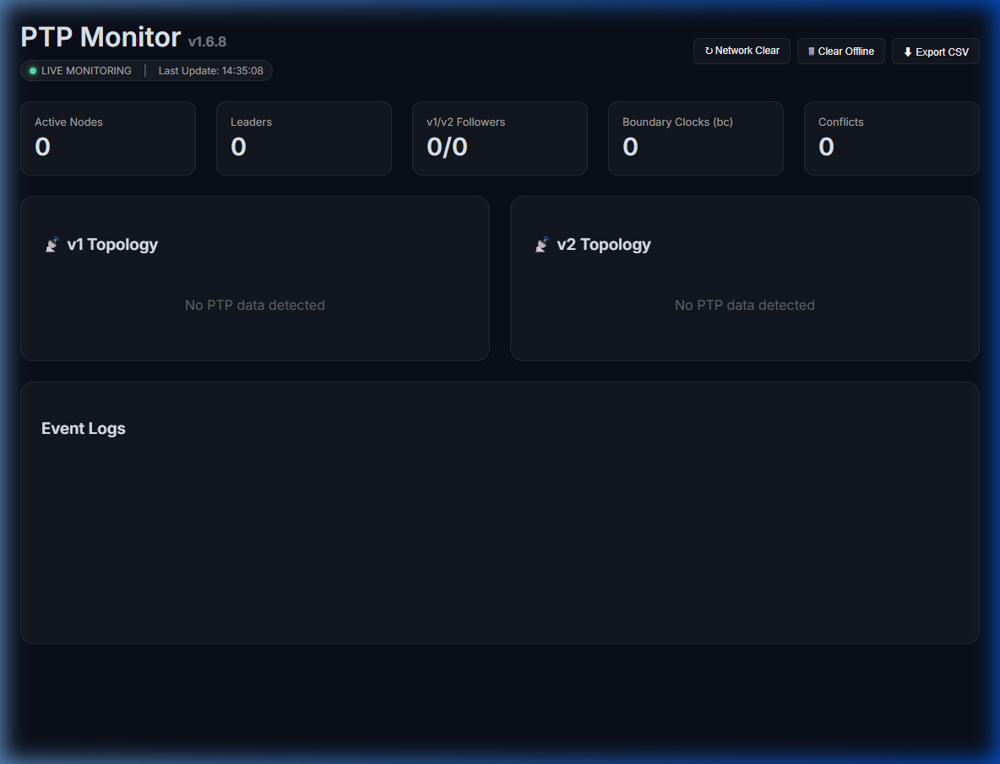

# PTPMonitor

PTP (Precision Time Protocol) monitoring and diagnostic tool.

## Features
- Network diagnostic for PTPv1/v2.
- Real-time status visualization.
- BMC Algorithm status analysis.

## Documentation
- [Manual (JP)](docs/manual_JP.md)
- [Manual (ENG)](docs/manual_EN.md)

## How to use
Run `PTPMonitor.exe` (requires proper configuration in `config.ini`).

## Changelog

### [v1.6.8] - 2026-04-29
#### Added
- **Safety & Robustness**:
    - Added confirmation dialogs for destructive actions (Clear All/Offline) in Web UI.
    - Added Live Monitoring indicator and Last Update timestamp to Web UI.
    - Implemented explicit IP binding for sockets to improve multi-NIC stability.
    - Added socket receive timeouts to prevent potential hangs.

### [v1.6.7] - 2026-04-06
#### Added
- **Monitoring Threshold Customization (config.ini)**:
    - Added `ExpectedDelayInterval`: Base interval for Delay_Req packets (seconds).
    - Added `DelayAlertThresholdRate`: Multiplier for alerting thresholds.
    - Added `OfflineTimeoutSeconds`: Duration before a device is marked as offline.
- **Dynamic Alert Visualization (Web UI)**:
    - Implemented logic to highlight `Delay Intv` in red based on "Baseline x Multiplier" configuration.

#### Fixed
- Resolved an issue where `Delay Interval` measurements were not displayed on the Web UI.

### [v1.6.6] - 2026-04-06
#### Added
- **Delay Request Interval Measurement**:
    - Implemented logic to measure real-time intervals of `Delay_Req` packets from Followers.
    - Added display of measured intervals next to `Uptime` in the Web UI.

### [v1.6.4] - 2026-04-06
#### Changed
- **PTPv1 UI Optimization**:
    - Hidden unnecessary interface values (e.g., Sync/Announce Logs) for PTPv1 (Dante) nodes to improve dashboard clarity.

### [v1.6.1] - 2026-04-04
#### Fixed
- **Uptime Display Stabilization**:
    - Corrected countdown and display logic for device uptime immediately after startup.
- **Documentation Update**:
    - Refined user manuals and `config.ini` descriptions for the v1.6.x series features.
